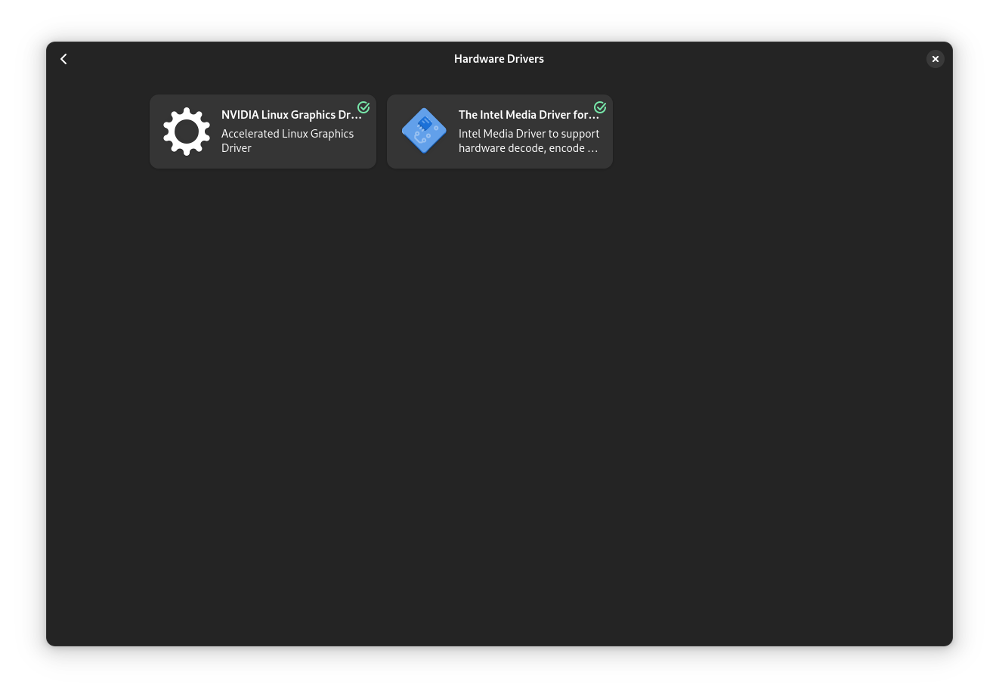
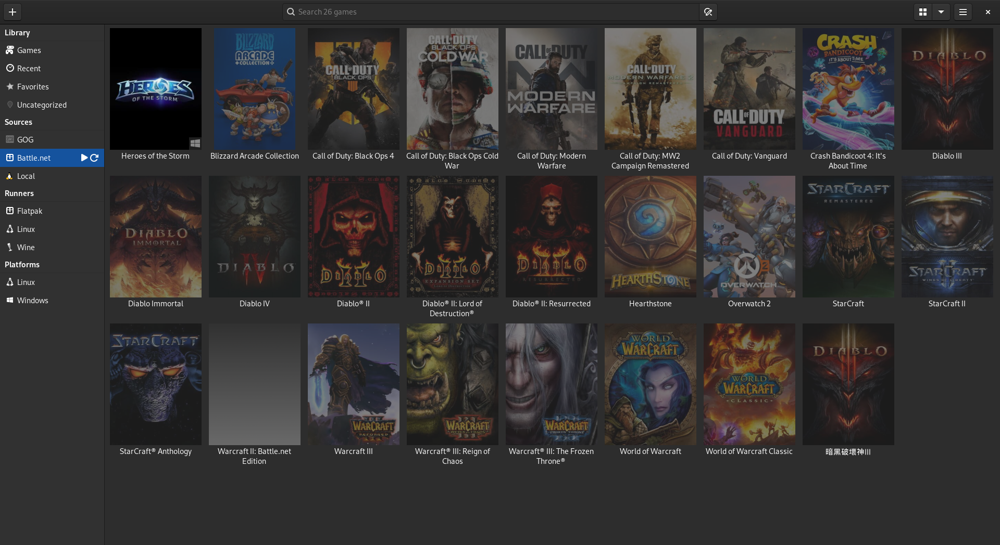

## A retrospective 

Ten years ago I have used my exact same workstation hardware to try my first linux desktop experience.
My hardware is: 
- Intel Xeon CPU E3-1231 v3
- Nvidia GTX 970
  - broke twice, but one time within warranty
  - replaced it with a GTX 1050Ti
- 16 GB DDR3 RAM

As you can tell, that is not really a powerful hardware nowadays anymore.

Back then I was using Ubuntu in dual boot with Windows 7. As I was not sure, if Linux would actually work as I hoped it to work, I didn't dare to completely wipe my Windows. Fortunately, I haven't done it as my Linux desktop experience was quite tedious. The biggest pain points I was facing were: 
- I was not that familiar with Linux itself (at least compared to now) 
- Installing the correct hardware drivers was a nightmare 
- Most games didn't offer native Linux support thus you had to rely heavily on [wine](https://www.winehq.org/)
- Almost no native gaming clients
- I could not get some games working on linux
- Looking at forums you occasionally found threads about people complaining to be banned, because they were playing on a non supported operating system 

## Why now? 
As time has passed, I was evaluating if I want to migrate my Windows 10 to Windows 11. After checking the [system requirements for Windows 11](https://www.microsoft.com/en-us/windows/windows-11-specifications), I found out that I my PC lacking on the following parts: 
- Convert Master Boot Record (MBR) to GUID Partition Table (GPT) to enable UEFI boot
- No Trusted Platform Module (TPM)
- Unsupported processor

While converting the MBR to GPT was a software issue and can be [solved with this guide](https://www.windowscentral.com/how-convert-mbr-disk-gpt-move-bios-uefi-windows-10), the remaining items are hardware issues. There might be the possibility to work around this, but I didn't like the direction Windows was aiming for anyway. Consequently, I have decided to give Linux another chance. 

## The Linux Experience 

### Which Distro? 

One of the first questions which come up, when you think about Linux is, which distribution to use? Given that I work for [Red Hat](https://www.redhat.com/en), I have decided to use [Fedora Workstation](https://fedoraproject.org/). This is mostly due to the [Red Hat Enterprise Linux](https://www.redhat.com/en/technologies/linux-platforms/enterprise-linux) like behavior.

### Usability

My impression is, that the usability has largely improved in the desktop space. The graphical user interface (GUI) looks very modern. You have the possibility to use multiple screens (as with MacOS). You can use the Software Center to obtain a ton of software including third parties, like `rpmfusion` and `flatpaks`. Most of the things can be configured via GUI, if you desire to do so. 

### Are all problems solved now?
Let me elaborate on the problems mentioned earlier. 

#### Drivers
Per default Fedora was shipped with the [NVIDIA nouveau](https://nouveau.freedesktop.org/) drivers. Those drivers worked well for me on native Linux games. However, they performed very poorly on games which were relying on Wine. Yet again I had to install the GPU drivers from NVIDIA. To my surprise this was a very easy task. The software center had automatically detected which third party driver my system would need and I could install them very comfortably via the GUI.

#### Gaming clients
Unfortunately some gaming clients like the [Blizzard Battle.net](https://www.blizzard.com/en-us/) or [GOG Galaxy](https://www.gog.com/wishlist/galaxy/release_the_gog_galaxy_client_for_linux) do not offer native Linux support. Consequently you will need to take a look at other solutions.
Currently there are differnet gaming clients available. The most common ones, besides [Steam](https://steamcommunity.com/), are [Heroic Games Launcher](https://heroicgameslauncher.com/) and [Lutris](https://lutris.net/). Both of those clients have their pros and cons. Lutris allows you to connect to the Battle.net
 but does not offer cloud save files for the GOG Galaxy. While the Heroic Games Launcher does support the cloud saves, you cannot use it for the Blizzard games. Consequently, there is no one size fits all solution. 

#### Cloud saves
An additional problem arises, when we talk about cloud saves. While, I cannot tell if this issue is persisnt across all gaming clients, but I can provide the following example: [FTL: Advanced Edition](https://www.gog.com/en/game/faster_than_light) is a strategy game which I had bought via GOG Galaxy (Note: I could have also bought it via Steam). To have my cloud save files, I would be required to use Heroic Games Launcher instead of Lutris. On the Heroic Games Launcher I have two options: 
1. Install the Linux native version of the game (preferred)
2. Install the Windows version of the game and use Wine.

After trying option 1, I rather quickly found out that I do not have access to my cloud save files as they are tied to my previous operating system installation. After wiping the linux native installation, I had installed the Windows version. Then I had access to my save files. Funnily enough, the save files are just text files which you can copy around and thus use them even with the Linux version. Nevertheless, to get the access to the cloud save from the previous Windows installation, you will have to download the Windows version. Especially as the GOG Galaxy does not offer a download of the cloud saves [neither via the website](https://www.gog.com/account/cloud-saves) nor [via an API](https://docs.gog.com/gc-cloud-saves/).

## Performance
Before I can elaborate on the performance, I need to clarify, that there are no metrics being compared between the operating systems. I will just refer to the same games on equal graphic settings and see if those feel fluid (like before). The games I will be referring to are:
- Heroes of the Storm
- Frostpunk
- Elden Ring

### Heroes of the Storm
- Client: Lutris
- Game acquired via: GOG Galaxy
- Native platform(s): Windows

Lutris allows you to install the [Battle.net Desktop Client](https://download.battle.net/de-de/desktop) and then the game via the client as usual. This game works very well on Linux with equal graphic settings, i.e. `High`. When playing around with ALT+TAB and the Super/Windows Key I found out that it is better to run this game with the `Display Mode: Windowed Fullscreen`. One thing which worked even better on Linux than Windows is, that I did not run into the [`Infinite Reconnecting screen`](https://us.forums.blizzard.com/en/heroes/t/infinite-reconnecting-screen/26423) which is some odd bug in the game which was never fixed.

### Frostpunk
- Client: Heroic Games Launcher
- Game acquired via: GOG Galaxy
- Native platform(s): Windows

There was no issue with playing the game. It runs fluent and had no issues when tabbing in and out. The cloud saves made some difficulties, but this seems to be game rather than platform specific.

### Elden Ring
- Client: Steam
- Game acquired via: Steam
- Native platform(s): Windows

This masterpiece is surely the most resource intense game on the list. Nevertheless, Linux was still able to run it without any issue on `High` graphic settings. Via Steam I could also easily connect my PS3 controller without any additional software and had access to all cloud saves. 

## Which games are problematic?

Generally speaking games which use kernel-level anti-cheat technology might not run on linux due to the use of Wine or Proton. A list of games relying on kernel-level anti-cheat can be found [here](https://www.pcgamingwiki.com/wiki/List_of_games_with_anti-cheat_technology). If you look at the list very carefully, you will see that Elden Ring also uses kernel-level anti-cheat. This was no issue for me, as I was not playing online.

While I have a strong opinion that kernel-level anti-cheat gaming software should not be used, because the kernel is not a place for user software. Especially not gaming software. A human friendly one minute explanation can be found on [Youtube from Pirate Software below](https://www.youtube.com/watch?v=V1HwhwXelZo):


## Conclusion

The linux desktop has become way more user friendly than it was before. As you have seen, there might still be some minor issues, but it is not really blocking you from using it as a main operating system. My experience is very positive and I am more than happy that I had spent time on it.
